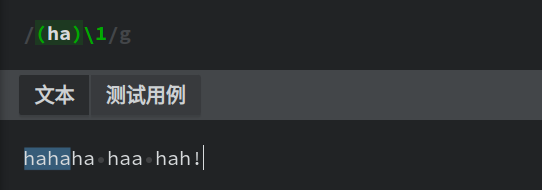
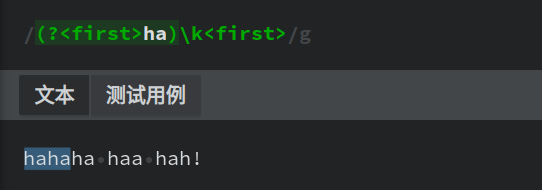
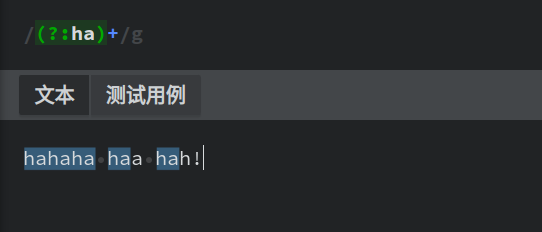

正则表达式，一直在用，但用得稀里糊涂。尤其在Linux下，一切皆文件，Linux三剑客：“grep，awk，sed”，哪个都离不开正则表达式，所以抽个时间，巩固一下正则表面式的内容。

## 用到的网站
* 👉[维基百科|正则表达式](https://zh.wikipedia.org/wiki/%E6%AD%A3%E5%88%99%E8%A1%A8%E8%BE%BE%E5%BC%8F)，先大致了解一下正则表达式。
* 👉[regexlearn](https://regexlearn.com/zh-cn/learn/regex101)，比较基础的练习，总共56道题，十几分钟就能做完，动画做得很直观，加深理解。
* 👉[regex101](https://regex101.com/quiz)，总共28道测试题，有难度，我自己做到前9道。除了测验之外，正则表达式的所有内容基本都能在这个网站上找到，比较靠谱的一个网站。
* 👉各种gpt助手，不必多言。

## 正则表达式重难点

### 贪婪模式与非贪婪模式

1. 贪婪模式：尽可能多地匹配相符内容。

    比如： `a.*a`，`a`代表首字母，`.`点字符表示除回车跟换行符的任意单个字符，`*`代表对之前`.`的贪婪模式匹配，即尽可能多地匹配任意多个单个字符，直到遇见下一个字母`a`，效果如下：

    

2. 非贪婪模式：与贪婪模式相反，仅匹配最少量的必要相符内容。

    比如：`r\w*?`，`r`表示首字母，`\w`在正则表达式中代表字母、数字或下划线，后面的`*?`表示针对`\w`的非贪婪模式匹配，所以最终效果就是，匹配以`r`为首的，后续为字母、数字、下划线字符模式中的`r`,具体效果如下：

    

### 零宽断言

零宽断言是正则表达式中的一种特殊的匹配模式，所谓断言，是说当它们在匹配字符串时，断言当前位置的前面或后面应该满足某种条件。零宽，是说以上这种断言都是零宽度的，它们自身不匹配任何字符，只是用来断言当前位置的前面或后面是否满足特定的条件。

根据匹配位置的不同，可分为先行断言跟后行断言，所谓先行断言，是说断言当前位置的后面应该满足某种条件；而后行断言，是说当前位置的前面应该满足某种条件；又根据匹配条件的不同，可分为正向断言跟负向断言，所谓正向，即表示肯定，负向，即表示否定。排列组合下来，总共有以下四种零宽断言的模式：

1. 正向先行断言（Positive Lookahead）：`(?=pattern)`，表示断言在当前位置的后面，模式 `pattern`会出现，如：
    
    `\d`在正则表达式中代表数字字符，`+`是对`\d`的修饰，表示至少要有一个`\d`，后面的`(?=PM)`，是对之前`\d+`的修饰，即断言`\d+`之后必有`PM`，但`(?=PM)`自身却不匹配任何字符，于是最终匹配到的只有`PM`之前的数字`3`。

2. 负向先行断言（Negative Lookahead）：`(?!pattern)`，表示在当前位置之后，模式 `pattern` 不会出现，如：
    
    `\d`在正则表达式中代表数字字符，`+`是对`\d`的修饰，表示至少要有一个`\d`，后面的`(?!PM)`，是对之前`\d+`的修饰，即断言`\d+`之后不能有`PM`，但`(?!PM)`自身却不匹配任何字符，于是最终匹配到的只有后面没有`PM`的数字`4`。

3. 正向后行断言（Positive Lookbehind）：`(?<=pattern)`，表示在当前位置之前，模式 `pattern` 会出现，如：
    
    `\$`在正则表达式中代表符号`$`本身，因`$`自身在正则表达式中具有匹配文本行尾的含义，所以这里要用到转义字符`\`，`\d`在正则表达式中代表数字字符，`+`是对`\d`的修饰，表示至少要有一个`\d`，前面的`(?<=PM)`，是对后面`\d+`的修饰，即断言`\d+`之前必有`$`字符，但`(?<=\$)`自身却不匹配任何字符，于是最终匹配到的只有`$`之后的数字`5`。

4. 负向后行断言（Negative Lookbehind）：`(?<!pattern)`，表示在当前位置之前，模式 `pattern` 不应该出现，如：
    
    `\$`在正则表达式中代表符号`$`本身，因`$`自身在正则表达式中具有匹配文本行尾的含义，所以这里要用到转义字符`\`，`\d`在正则表达式中代表数字字符，`+`是对`\d`的修饰，表示至少要有一个`\d`，前面的`(?<!PM)`，是对后面`\d+`的修饰，即断言`\d+`之前不能出现`$`字符，但`(?<!\$)`自身却不匹配任何字符，于是最终匹配到的是前面没有`$`字符的`1024`。
---
总结：

* 先行断言是从当前位置向后查找，用于约束当前位置之后的字符，而后行断言是从当前位置向前查找，用于约束当前位置之前的字符。
* 正向断言是约束条件应该出现，而负向断言是约束条件不应该出现。
* 先行断言和后行断言都是零宽断言，意味着它们只是做条件约束，而不会消耗字符串。

### 分组和引用 

在正则表达式中，分组和引用，可以帮助我们匹配和操作字符串中的特定部分。其中，分组允许我们将多个模式组合在一起，并对它们进行操作，而引用则允许我们在同一正则表达式中引用先前匹配的内容。在正则表达式中，使用圆括号 `()` 可以创建一个分组，被创建的分组通常被视为一个整体。根据分组是否能被引用，分为捕获分组跟非捕获分组，其中，捕获分组又可分为数字分组跟命名分组。具体如下：

1. 数字捕获分组跟数字引用

    数字捕获分组跟数字引用是对应的，即被数字分组捕获的分组，需要通过数字引用来重新引用。如下：

    `(ha)`表示利用 `()`将 `ha` 捕获为数字分组`1`，并在之后使用数字引用`\1`引用捕获到的第一个分组，于是匹配到的字符串，是两个连续的 `ha`。

2. 命名捕获分组跟命名引用

    命名捕获分组跟命名引用是对应的，即被命名分组捕获的分组，需要通过命名引用来重新引用。命名捕获组的语法如下：`(?<name>group)`或`(?'name'group)`，其中`name`表示捕获组的名称，`group`表示捕获组里面的正则。我们可以用`\k<name>` 或 `\k'name'`的形式来对前面的命名捕获组捕获到的值进行引用，如下：

    `(?<first>ha)`表示使用 `(?<first>ha)`命名捕获的方式将 `ha` 捕获为命名分组`first`，而`(\k<first>)`表示命名分组`first`的引用。

    ⚠️ 需要注意的是，这里的`()`前的`?`并非是非捕获分组的意思，而是命名捕获的格式。

3. 非捕获分组

    非捕获组，跟捕获组相比，它不会把正则匹配到的内容保存到分组里面。
    

    字符串分组`ha`虽然被捕获，但却未被分组，所以它无法通过数字分组跟命名分组的方式被引用。

    非捕获分组，常用于在多个固定的字符串中匹配其中一个，如下：
    

    如上，`(?:white|black)`该非捕获分组匹配到字符串`white`或`black`。

    但是，这里需要注意的是，非捕获分组跟正则表达式中的`|`表达式的区别，如下：
    
    `|`表达式没有包围在()里，其范围是整个正则表达式对， 即要么匹配`|`左边的内容，要么匹配`|`右边的内容。再比如，`z|food`能匹配`z`或`food`。`(?:z|f)ood`则匹配`zood`或`food`。

4. 分支重置分组

    分支重置组内的选择项共享相同的捕获组。语法是`(?|regex)`，其中`(?|`打开组，而`regex`可以是任意的正则表达式。如果不使用任何选择项或捕获分支重置组内的组，则其特殊功能将不起作用。那么它将作为一个非捕获组。        

    如：正则表达式`(?|(a)|(b)|(c))`由一个带有三个选择项的分支重置组组成。此正则表达式匹配`a` ，`b`或`c` 。正则表达式只有一个捕获组，编号为1，由所有三个选择项共享。匹配结束后，`$1`存储`a`,`b`或`c` ，具体示例如下：
    
    通过分支重置分组，分组`1`中，要么是a，要么是b，要么是c，所以当我们通过`(?|(a)|(b)|(c))\1\1\1`，在重置分组后又引用三次`1`号分组，每次匹配到的，都是同一个字母。

    再比如：
    
    匹配到的要么是`apple apple`，要么是`banana banana`。
    将此与正则表达式`(a)|(b)|(c)`进行比较。后者也匹配`a` ，`b`或`c` 。但是它具有三个捕获组。匹配结束后，`$1`保留`a`或什么都不保留，`$2`保留`b`或什么都不保留，而`$3`保留`c`或什么都不保留。

